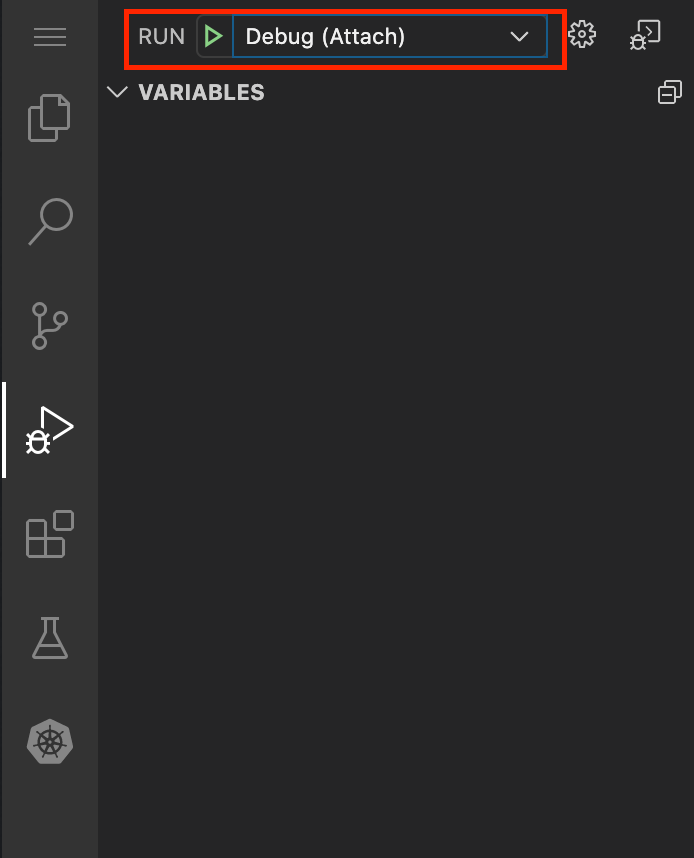

To debug our application running in Kubernetes we need to create a remote debug configuration in our IDE. This will work for any remote process (doesn’t have to be running in Kubernetes).


```dashboard:open-dashboard
name: Editor
```

On the left hand side of the IDE tab, click the Run/Debug icon to open the Run/Debug panel, then click on the `create a launch.json file` link.


The IDE will create a default launch configuration for the current file and for `K8sDemoAppApplication`.
We need to add another configuration for remote debugging.

Copy and paste the following JSON snippet into your `launch.json` *ABOVE* the first json entry (inside the `configurations` block).
```workshop:copy
text: |-
        {
            "type": "java",
            "name": "Debug (Attach)",
            "request": "attach",
            "hostName": "localhost",
            "port": 5005
        },
```

Now select the `Debug (Attached)` option from the drop down and click the Run button

This should attach the debugger to the remote port (5005) established by Skaffold



Now you can execute the following command to make a request to the application.  You will not see a response immediately because the debugger in the IDE will
break at our breakpoint. Return to the Editor and notice the debug toolbar in the top center of the screen, and the debug info frames on the left and bottom of the screen. You can step through the code, view variable values, etc.

```execute-2
curl localhost:4503
```

Stop the Skaffold process by executing the following command
```terminal:interrupt
session: 1
```


---
